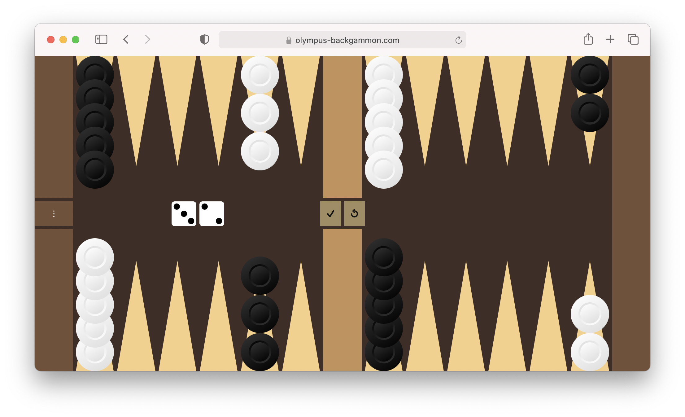
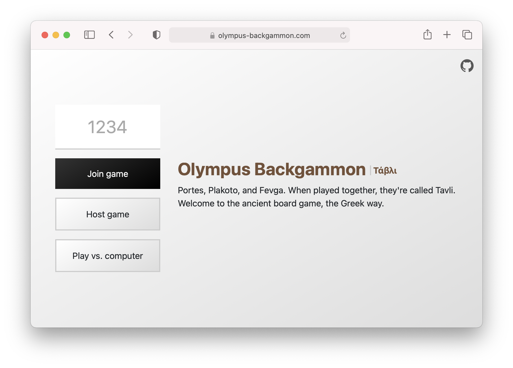
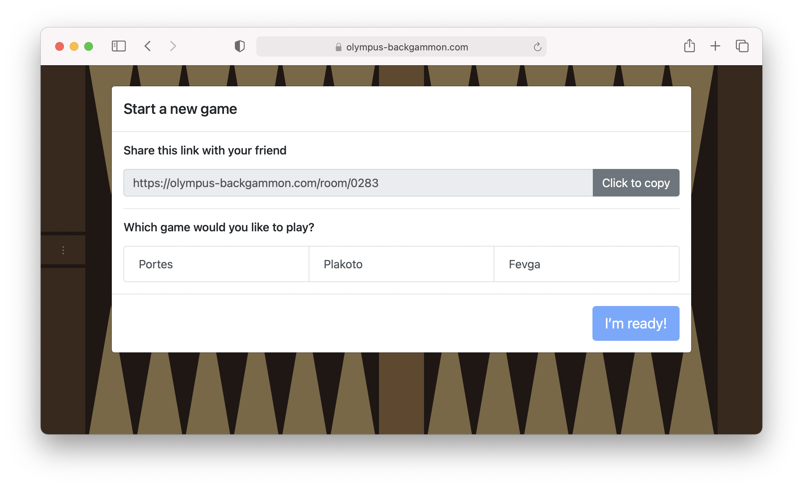
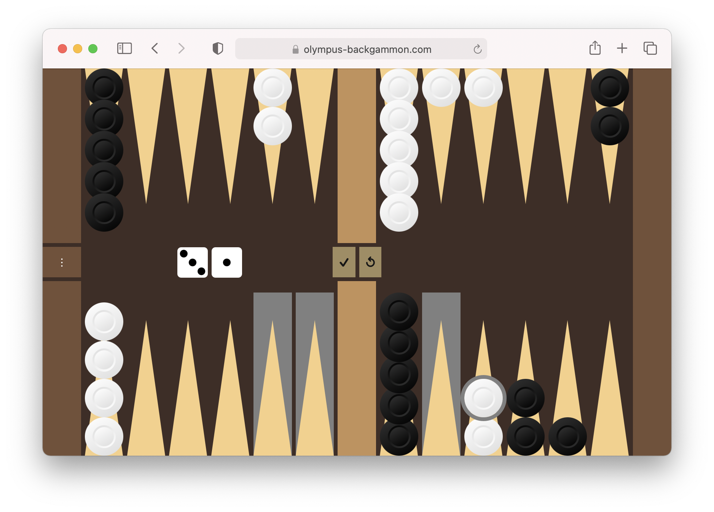
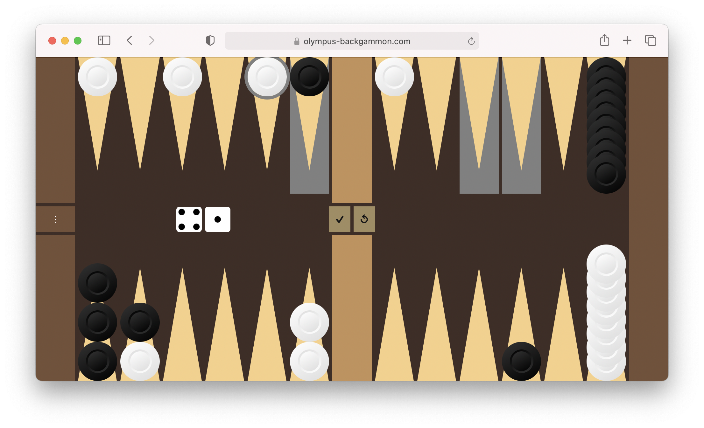

# Olympus Backgammon

Portes, Plakoto, and Fevga are three Greek variants of backgammon commonly played together as Tavli. Olympus Backgammon allows players to play these games against their friends online or against a computer. Games can be setup in seconds at [olympus-backgammon.com](https://olympus-backgammon.com) on desktop or on mobile.

  

## Starting a game

From the homepage, the player can either join a game created by their friend by entering the four digit code or they can create a new game versus a human or a computer. The player who creates the game will see the room code and gets to choose the game variant.

  

  

## How to play

Both players roll a die to go first. To make a move, click on one of your checkers. The highlighted spaces show where you are able to move. Checkers can be moved a number of spaces equal to the number on each dice. The object of the game is to advance your checkers all the way around the board before your opponent. To learn more, follow the links for each variant.

### Portes

[How to play Portes](https://www.bkgm.com/variants/Portes.html)

  

### Plakoto

[How to play Plakoto](https://www.bkgm.com/variants/Plakoto.html)

  

### Fevga

[How to play Fevga](https://www.bkgm.com/variants/Fevga.html)

## Frontend repository

React frontend for the work-in-progress Olympus Backgammon project. Connects to a separate [backend](https://github.com/michaelti/olympus-backgammon-backend) Node.js server and the [olympus-bg](https://github.com/michaelti/olympus-bg) node module for gameplay logic.

### Development

1. Install dependencies: `npm install`
2. Run the start script: `npm start`

Be sure to create a local `.env` file in the project root with the key `REACT_APP_BACKEND_URL` pointing to the backend server.

### Deployment

This project is hosted externally on a private server; these instructions are proprietary for the time being.

From the project directory:

1. Pull the latest changes: `git pull`
2. If there are updated dependencies, install them: `npm ci --production`
3. Build for production: `npm run build`
